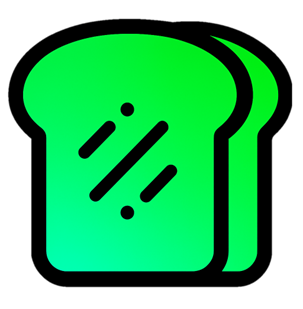

# 🌐 Guia de Localização Multiidioma - GreenToastSoftware

## Estrutura de Localização

Este documento descreve como o site foi organizado para suportar múltiplos idiomas e como adicionar novos idiomas.

## 📂 Padrão de Organização

```
GreenSoftwareSiteHTML/
├── index.html                 # Versão padrão (Inglês)
├── about.html
├── contact.html
├── styles.css                 # CSS compartilhado
├── script.js                  # JavaScript compartilhado
│
├── ja/                        # Japonês (日本語)
│   ├── index.html
│   ├── about_ja.html
│   ├── contact_ja.html
│   ├── learn/
│   └── README.md
│
├── pt/                        # Português (Próximo)
│   ├── index.html
│   ├── about_pt.html
│   ├── contact_pt.html
│   └── README.md
│
├── es/                        # Espanhol (Próximo)
│   ├── index.html
│   ├── about_es.html
│   ├── contact_es.html
│   └── README.md
│
└── languages.html             # Seletor de idiomas
```

## 🔤 Convenção de Nomenclatura

### Nomes de Arquivos
- **Idioma padrão (Inglês)**: `about.html`, `contact.html`
- **Outros idiomas**: `about_[código].html`, `contact_[código].html`
  - Códigos ISO 639-1: `ja` (Japonês), `pt` (Português), `es` (Espanhol)

### Atributos HTML
```html
<!-- Sempre incluir o atributo lang correto -->
<html lang="ja">     <!-- Japonês -->
<html lang="pt-BR">  <!-- Português do Brasil -->
<html lang="pt-PT">  <!-- Português de Portugal -->
<html lang="es">     <!-- Espanhol -->
<html lang="en-US">  <!-- Inglês -->
```

## 🔄 Como Adicionar um Novo Idioma

### Passo 1: Criar a Pasta
```bash
mkdir [código-idioma]
mkdir [código-idioma]/learn
```

### Passo 2: Copiar e Traduzir Arquivos

1. Copie os arquivos HTML da pasta raiz para a nova pasta
2. Renomeie com o padrão: `[página]_[código].html`
3. Traduza todo o conteúdo
4. Atualize os links internos para a pasta do idioma

### Passo 3: Configurar Caminhos Relativos

```html
<!-- ✅ Correto para pasta de idioma -->
<link rel="stylesheet" href="../styles.css">


<!-- ❌ Incorreto -->
<link rel="stylesheet" href="styles.css">

```

### Passo 4: Atualizar Links Internos

```html
<!-- Dentro de arquivo em pasta de idioma -->
<a href="index.html">Home</a>              <!-- Página do mesmo idioma -->
<a href="about_pt.html">Sobre</a>          <!-- Outra página do mesmo idioma -->
<a href="../index.html">English</a>        <!-- Voltar para inglês -->
```

### Passo 5: Adicionar ao `languages.html`

```html
<a href="pt/index.html" class="language-card">
    <div class="flag">🇵🇹</div>
    <div class="name">Português</div>
    <div class="native">Português</div>
</a>
```

### Passo 6: Criar README.md

```markdown
# GreenToastSoftware - Versão em [Idioma]

## Arquivos Inclusos
- [Lista de arquivos]

## Próximas Etapas
- [ ] Blog em [idioma]
- [ ] Documentação
```

## 📋 Checklist para Tradução

- [ ] Todos os textos de navegação
- [ ] Títulos de seções
- [ ] Descrições e parágrafos
- [ ] Rótulos de formulários
- [ ] Placeholders de entrada
- [ ] Textos de botões
- [ ] Mensagens de erro/sucesso
- [ ] FAQ
- [ ] Footer

## 🎯 Strings Importantes para Tradução

### Navegação
```
- Home = Início/Casa/Página Principal
- Innovation = Inovação
- Services = Serviços
- About Us = Sobre Nós
- Contact Us = Contato/Entre em Contato
```

### Botões Comuns
```
- See our creations = Ver Nossas Criações
- About Us = Sobre Nós
- Send Message = Enviar Mensagem
- Submit = Enviar
```

### Formulário de Contato
```
- Full Name = Nome Completo
- Email = Email/Correio Eletrônico
- Phone = Telefone
- Context = Contexto/Assunto
- Message = Mensagem/Descrição
- Description = Descrição
- Send = Enviar
```

## 🔍 Verificação de Qualidade

Antes de publicar uma nova versão de idioma:

### 1. Verificação Técnica
- [ ] Todos os links funcionam
- [ ] Caminhos de imagem estão corretos
- [ ] CSS é carregado corretamente
- [ ] Formulários funcionam
- [ ] Layout é responsivo

### 2. Verificação de Tradução
- [ ] Sem textos em inglês restantes
- [ ] Consistência terminológica
- [ ] Contexto apropriado
- [ ] Formatação mantida
- [ ] Acentos e caracteres especiais corretos

### 3. Verificação de Usabilidade
- [ ] Navegação é intuitiva
- [ ] Botões são clicáveis
- [ ] Texto é legível
- [ ] Espaço é suficiente para texto traduzido
- [ ] Sem quebras de layout

## 📊 Status de Localização

| Idioma | Código | Status | Versão | Data | Arquivos |
|--------|--------|--------|--------|------|----------|
| English | en | ✅ Completo | 1.0 | 2020 | 5 |
| Japonês | ja | ✅ Completo | 1.0 | 2026 | 3 |
| Português | pt | 🔄 Planejado | - | - | - |
| Espanhol | es | 🔄 Planejado | - | - | - |

## 💾 Backup e Versionamento

```
GreenSoftwareSiteHTML/
├── .git/                  # Controle de versão
├── backups/
│   ├── pt_v1_draft.zip
│   └── es_v1_draft.zip
└── translations/          # Documentação de tradução
    ├── pt_glossary.txt
    └── es_glossary.txt
```

## 🔗 SEO e hreflang (Futuro)

Para implementação futura no `<head>`:

```html
<!-- English -->
<link rel="alternate" hreflang="en" href="https://greentoastsoftware.com/index.html">

<!-- Japonês -->
<link rel="alternate" hreflang="ja" href="https://greentoastsoftware.com/ja/index.html">

<!-- Português -->
<link rel="alternate" hreflang="pt-BR" href="https://greentoastsoftware.com/pt/index.html">
```

## 🎓 Recursos Úteis

- **ISO 639-1 Codes**: https://en.wikipedia.org/wiki/List_of_ISO_639-1_codes
- **W3C HTML Internationalization**: https://www.w3.org/International/
- **Unicode CLDR**: https://cldr.unicode.org/

## 📞 Suporte

Para dúvidas sobre localização:
- Email: official_greentoastsoftware@outlook.com
- Assunto: "Localização de Idioma"

---

**Última atualização**: 28 de janeiro de 2026  
**Versão**: 1.0  
**Status**: Ativo
